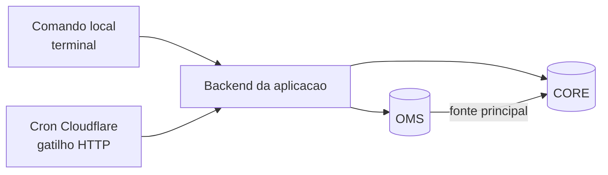
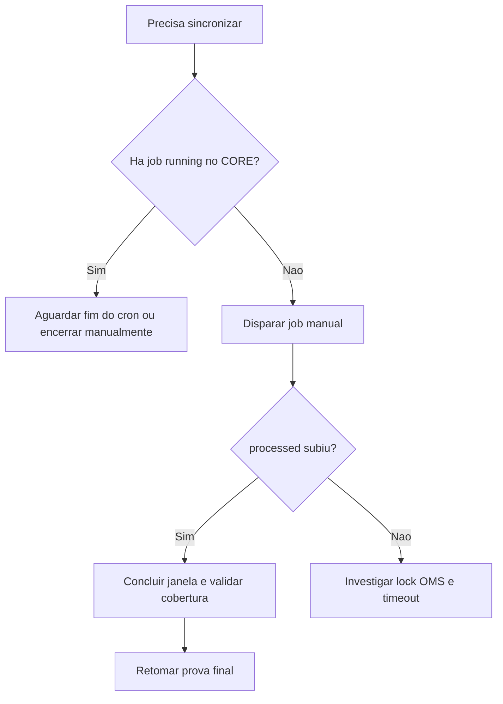

# Mapa Operacional Sync OMS -> Mirror (Resumo Executivo)

Data de referencia: 2026-07-01

## Objetivo

Garantir sincronizacao confiavel de dados do OMS para o mirror no CORE, com rastreabilidade operacional e criterio claro para retomada da prova final de reconciliacao.

## Desenho em 30 segundos

Leitura rapida:
1. Comandos sao executados localmente.
2. Cron Cloudflare apenas dispara a rota interna.
3. Processamento efetivo roda no backend da aplicacao.
4. OMS e CORE sao bancos remotos conectados pelo backend.

## Responsabilidade por ambiente

1. Local
- Execucao de comandos operacionais (node, tsx).

2. Cloudflare
- Agendamento e disparo HTTP periodico.

3. OMS
- Fonte de dados para leitura de payloads.
- Atualmente ha escrita tecnica no schema integration (fila/retry/DLQ).

4. CORE
- Armazena mirror.raw_payloads e estado dos jobs.

## Sinais de saude

1. Job com status running ou completed e processed crescente.
2. phase em processing_events durante carga.
3. lockSkipped eventual, nao recorrente em sequencia longa.
4. Queda de pendencias com retry no OMS.

## Sinais de risco

1. EAUTHTIMEOUT recorrente em jobs de cron.
2. Jobs stale apos 120 min sem conclusao.
3. running prolongado sem fetched/processed.
4. lockSkipped continuo por disputa de lock.

## Decisao operacional rapida

## Criterio de pronto para sair da etapa de sync

1. Job manual concluido com processed > 0.
2. Cobertura de maio e junho validada no mirror.
3. Pendencias de retry no OMS em nivel controlado.
4. Sem job running bloqueando nova janela.

## Risco de governanca (ponto de atencao)

Se a diretriz for OMS estritamente read-only, o desenho atual precisa ajuste:
1. Remover escrita tecnica no OMS (integration.sync_events e integration.failed_jobs).
2. Mover fila, retry e DLQ para o CORE.
3. Manter OMS apenas como fonte de leitura.

## Proximo passo recomendado

1. Finalizar a janela de sincronizacao em andamento.
2. Validar cobertura mensal no mirror.
3. Executar prova final da reconciliacao na mesma janela temporal.

## Referencia tecnica detalhada

Documento completo: docs/MAPA-OPERACIONAL-SYNC-OMS-MIRROR.md
