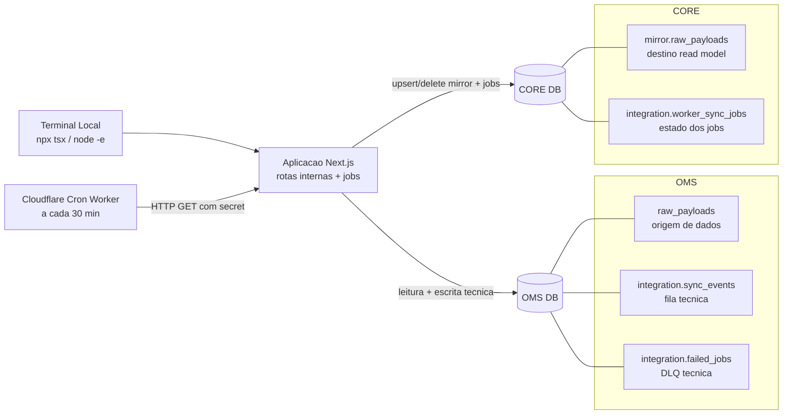
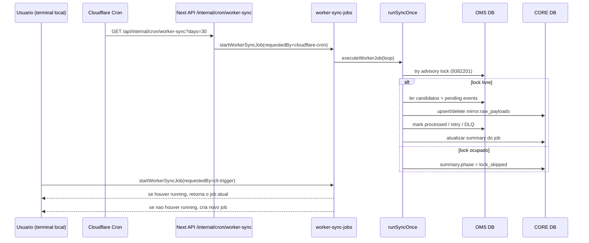
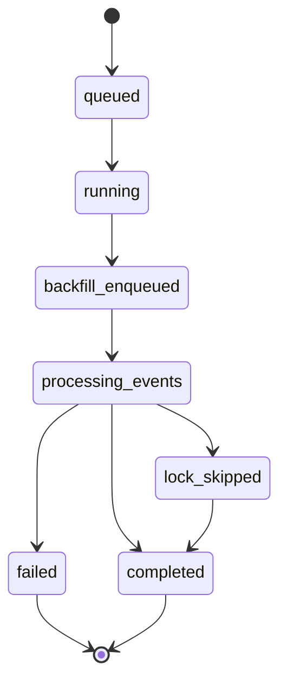
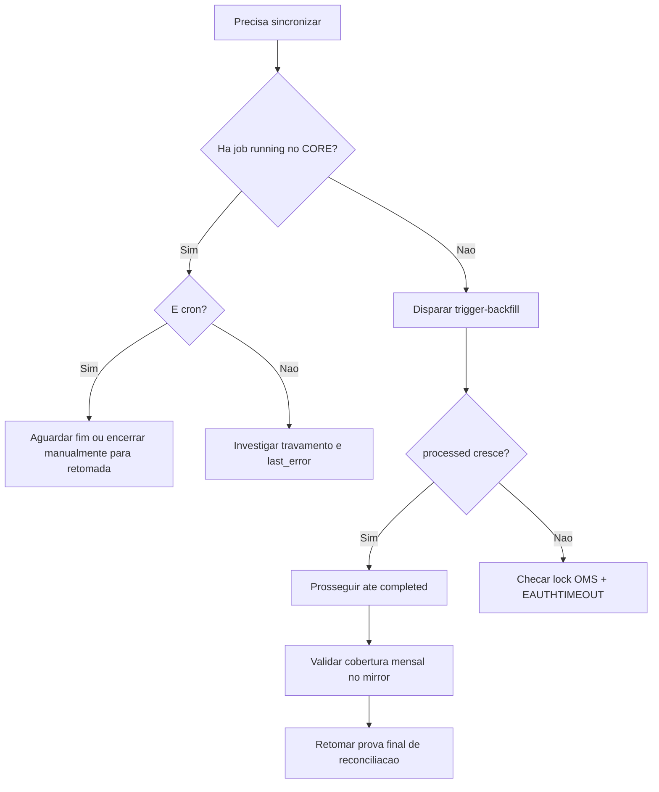

# Mapa Operacional - Sync OMS para Mirror CORE

Data de referencia: 2026-07-01

## Objetivo

Este documento consolida, em um unico mapa, o desenho operacional e as regras praticas do fluxo de sincronizacao OMS -> CORE (mirror), incluindo:
- onde os comandos rodam
- quem dispara o cron
- como o worker processa
- onde ha leitura/escrita
- como interpretar travamentos (lock, stale, timeout)

## Visao Geral (Desenho)

## Onde cada parte roda

1. Comandos operacionais
- Rodam no terminal local (sua maquina): node -e, npx tsx scripts/*.
- Esses comandos disparam codigo do projeto que conecta em bancos remotos.

2. Cron
- O agendamento roda no Cloudflare Worker de cron.
- O cron chama a rota interna da aplicacao via HTTP autenticado.

3. Processamento de sync
- Roda no backend da aplicacao (Node runtime), nao dentro do Cloudflare.
- O backend fala com OMS e CORE via conexao de banco.

## Fluxo detalhado de execucao

## Contrato de leitura/escrita por banco

### OMS

Leitura:
- raw_payloads
- integration.sync_events (pending/retries)

Escrita tecnica:
- integration.sync_events (mark processed, retries, next_retry_at, error_message)
- integration.failed_jobs (dead letter)
- infraestrutura tecnica (ensureInfrastructure): schema/tabela/coluna no schema integration

Nao ha alteracao de dominio em raw_payloads pelo worker atual.

### CORE

Escrita:
- mirror.raw_payloads (upsert/delete)
- integration.worker_sync_jobs (status, runs, summary, last_error)

Leitura:
- estado de jobs
- cobertura mensal no mirror

## Estados de job e significado

Interpretacao rapida:
1. lock_skipped
- outro processo ja segurava lock do OMS.
- nao significa corrupcao; significa ciclo sem processamento.

2. stale apos 120 min
- job ficou em running por tempo excedido e foi marcado como failed por protecao.

3. EAUTHTIMEOUT
- timeout de autenticacao/conexao (intermitente).
- tende a gerar retry, sem dead letter imediato.

## Diagnostico operacional (passo a passo)

1. Ver ultimos jobs no CORE
- confirmar se existe running
- checar phase, processed, fetched, last_error

2. Ver lock advisory no OMS (objid 9382201)
- se houver sessao antiga/idle segurando lock, liberar sessao

3. Decidir acao
- se cron running: aguardar ou encerrar manualmente para retomada controlada
- se sem running: iniciar CLI trigger

4. Validar progresso
- processed deve subir
- lockSkipped nao pode ser recorrente por longos periodos

5. Fechar janela
- medir cobertura mensal no mirror (maio/junho)
- medir pendencias retry no OMS

## Mapa de decisoes

## Fronteira de seguranca (regra OMS)

Atualizacao 2026-07-13: implementado no codigo. O fluxo padrao (`SYNC_CONTROL_TARGET=core`)
nao escreve mais no OMS:
1. Removida a escrita tecnica no OMS (fila/retry/DLQ/infra) do caminho padrao.
2. Fila/retry/DLQ e lock agora vivem no CORE (`integration.sync_queue`, `integration.failed_jobs`).
3. OMS permanece apenas como fonte de leitura de `raw_payloads`.

A `sync_queue` no CORE e EFEMERA (linha removida no sucesso) e a DLQ tem retencao
(`DLQ_RETENTION_DAYS`), garantindo que o CORE nao infle.

Atualizacao 2026-08-18: o fallback `SYNC_CONTROL_TARGET=oms` foi **removido do codigo**, nao so
desativado por default. `WorkerEnv` nao tem mais esse campo, e `OmsRepository` nao tem mais nenhum
metodo de escrita/controle (`ensureInfrastructure`, locks, fila, retry, DLQ) — so os dois metodos de
leitura de `raw_payloads`. O CORE e o unico alvo de controle tecnico possivel, garantido pelo
compilador (a classe nem implementa mais a interface de controle), nao so por configuracao. Ver item
6 de "Verificacao pendente da Parte 1" em `docs/PLAN-CORRECAO-CONSUMO-E-MATERIALIZACAO.md`.

Pendente (governanca): permissao SELECT-only no OMS, migracao de historico legado para
auditoria e limpeza das tabelas `OMS.integration.*`.

## Referencias de implementacao

- scripts/trigger-backfill.ts
- scripts/list-jobs.ts
- scripts/process-backlog.ts
- src/features/integration/worker-sync-jobs.ts
- src/features/integration/worker-job-repository.ts
- src/workers/sync/service.ts
- src/workers/sync/repositories/oms-repository.ts
- src/workers/sync/repositories/core-repository.ts
- src/workers/sync/db.ts
- src/app/api/internal/cron/worker-sync/route.ts
- cloudflare/worker-sync-cron/src/index.ts
- cloudflare/worker-sync-cron/wrangler.jsonc
